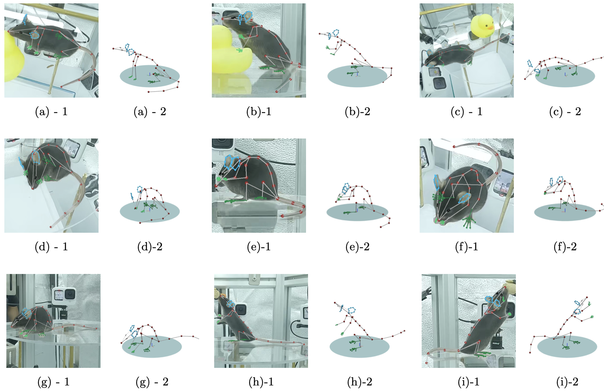
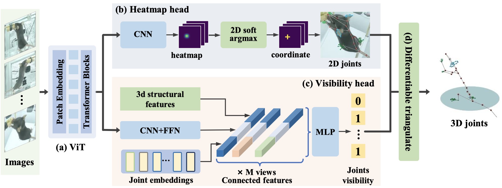

# MouseTotalCapture


## Introduction

This is the repository of the paper "Mouse Total Capture: 3D Motion and Expression Capture for the Freely Moving Mouse". More details can be found at our [homepage](https://metaverse-ai-lab-thu.github.io/MouseTotalCapture)

</details><div align=center></div>
<!-- </details><div align=center></div> -->

## Dataset

MousePano dataset contains the annotation of whole-body [92 keypoints](https://github.com/zhaojiachen1994/MouseTotalCapture/blob/main/figures/kpt_def2.png) for a freely moving mouse. The annotation covers the trunk, limbs, tail, eyes, ears, fingers, and toes, providing a data foundation for fine-grained mouse behavior analysis. The annotations follow the [COCO format](https://cocodataset.org/#format-data). 

The 2D annotation file contains the following items
```
images{[
  'file_name': str,
  'height': int,
  'width': int,
  'id': int
]}

annotations{[
  'image_id': int,
  'id': int
  'cam': str,
  'categoryi_d': 1,
  'segmentation': [],
  'num_keypoints': 92,
  'area': float,
  'iscrowd': 0,
  'bbox': list([x, y, w, h]),
  'keypoints': list([x, y, v] * 24),
  'face_kpts': list([x, y, v] * 32),
  'face_valid': bool, whether the face is visible in this view
  'Leye_valid': bool, 
  'Lear_valid': bool,
  'Rear_valid': bool,
  'Reat_valid': bool,
  'face_box': list([x, y, w, h]),
  'lefthand_kpts': list([x, y, v] * 8),
  'lefthand_valid': bool,
  'lefthand_box': list([x, y, w, h]),
  'leftfoot_kpts': list([x, y, v] * 10),
  'leftfoot_valid': bool,
  'leftfoot_box': list([x, y, w, h]),
  'righthand_kpts': list([x, y, v] * 8),
  'righthand_valid': bool,
  'righthand_box': list([x, y, w, h]),
  'rightfoot_kpts': list([x, y, v] * 10),
  'rightfoot_valid': bool,
  'rightfoot_box': list([x, y, w, h]),
]}

groups{[
  'scene_name': str
  'cams':  list, camera IDs in this scene
  'image_id':  list, image IDs in this scene 
]}
```

The 3D annotation file contains 

```
[scene_name: list([92, 4]), [x, y, z, v]]
```

The dataset is available [here](https://docs.google.com/forms/d/e/1FAIpQLSfbl1b3TX9y8WMIHZbruuX0inwC9JfEJg74GxReB2vT4WHHgw/viewform?usp=sf_link)

## Structure-aware Triangulation Network


</details><div align=center></div>

* This project is based on mmpose=0.29.0, mmdet=2.25.3, mmcv 1.7.0. 

* Pretrain the 2D backbone
The first step is to pretrain the 2D detector on the 

```

``` 


## BibTeX

```
@article{Zhao2024MouseTotalCapture,
  author    = {Jiachen Zhao, Tao Yu, Liang An, Qichen Qian, Fang Deng},
  title     = {Mouse Total Capture: 3D Motion and Expression Capture for the Freely Moving Mouse},
  journal   = {Under review},
  year      = {2024},
}
```


